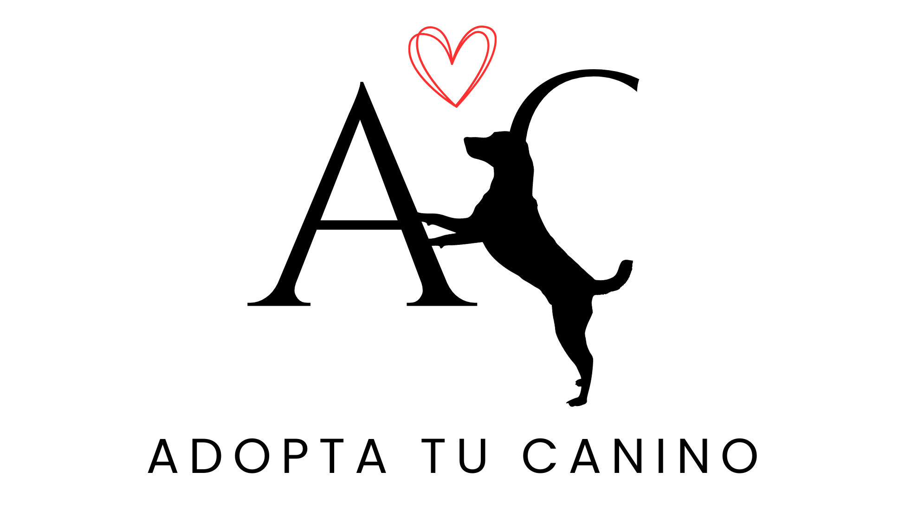

<p align="center">
  
</p>


# Adopta tu canino 🐶

## 📌 Descripción del proyecto
Aplicación web desarrollada como Trabajo Fin de Máster (TFM) cuyo objetivo es facilitar el proceso de adopción de perros por parte de protectoras y asociaciones, al igual que para los usuarios interesados en adoptar una nueva mascota.

La aplicación permite consultar la información de los perros disponibles para adopción, incluyendo datos como su edad, raza, tamaño, carácter, compatibilidad con otros animales, necesidades especiales, fotografías y vídeos.

Los usuarios podrán registrarse, iniciar sesión y enviar solicitudes de adopción para los perros disponibles. Por otra parte, los usuarios autorizados podrán gestionar la información de los animales y gestionar las solicitudes recibidas, pudiendo rechazarlas o aceptarlas.

Además, los usuarios podrán recibir recomendaciones de adopción mediante el uso de un chatbot (en proceso de realización ⚙)

## 🆗 Funcionalidades implementadas

- Visualización del listado de perros disponibles para adopción.
- Gestión de perros mediante una API REST.
- Gestión de fotografías y vídeos asociados a los perros.
- Creación y consulta de solicitudes de adopción.
- Aceptación y rechazo de solicitudes mediante endpoints específicos.
- Actualización automática del estado de adopción de un perro cuando una solicitud es aceptada.

## 👷🏽‍♀️ Funcionalidades previstas

- Visualización de la información de cada perro.
- Registro e inicio de sesión de usuarios.
- Autenticación mediante JSON Web Token (JWT).
- Filtrado de perros según sus características.
- Gestión de perros y solicitudes por usuarios autorizados.
- Recomendaciones de adopción mediante un chatbot.
- Migración de la base de datos de SQLite a MySQL.

## 👩🏼‍💻 Tecnologías utilizadas 
### Backend
- Python
- Django
- Django REST Framework
- SQLite para desarrollo local

### Frontend
- React
- Vite
- React Router
- React Bootstrap
- CSS

### Tecnologías previstas
- JSON Web Token (JWT)
- MySQL

## 📁 Estructura del proyecto
```text
dog_adoption/
├── backend/
├── frontend/
├── docs/
    ├── logo_adopta_tu_canino.png
├── .gitignore
├── README.md
```

### Arquitectura del proyecto
La aplicación está estructurada en dos partes principales:
- **Backend**: desarrollado con Django. Se encarga de la lógica de negocio, el acceso a la base de datos y la exposición con la API REST.
- **Frontend**: desarrollado con React y Vite. Se encarga de la interfaz de usuario y la comunicación con la API del backend.

Gracias a esta separación, se permite distribuir las responsabilidades de la aplicación y facilitar su mantenimiento y evolución.

##  ⚙ Ejecutar el proyecto

### 1. Clonar el repositorio

```bash
git clone https://github.com/Vero7nicaRS/adopcion-perros.git
cd dog_adoption
```

### 2. Configuración del Backend

Acceder a la carpeta "backend":
```bash
cd backend
```

Crear el entorno virtual:
```bash
python -m venv .venv
```

Activar el entorno virtual:
```bash
# Windows
.venv\Scripts\activate

# Linux/Mac
source .venv/bin/activate
```

Instalar las dependencias:
```bash
pip install -r requirements.txt
```

Migraciones y ejecución del programa:
```bash
python manage.py migrate
python manage.py runserver
```

El backend estará disponible en:
```bash
http://127.0.0.1:8000/
```

### 3. Configuración del Frontend

Desde la raíz del proyecto, acceder a la carpeta "frontend":
```bash
cd frontend
```

Instalar las dependencias:
```bash
npm install
```

Ejecutar el proyecto:
Introducir la siguiente línea de comando: 

```bash
npm run dev
```

El frontend estará disponible en:
```text
http://localhost:5173/

```

## Endpoints desarrollados
Los siguientes endpoints son orientativos y se actualizarán conforme avance el desarrollo de la aplicación.

### Perros

| Método | Endpoint | Descripción |
|--------|----------|-------------|
| GET | /adopta_tu_canino/perros | Obtener todos los perros |
| GET | /adopta_tu_canino/perros/:id | Obtener un perro en concreto |
| POST | /adopta_tu_canino/perros | Crear un perro |
| PUT | /adopta_tu_canino/perros/:id | Modificar un perro |
| PATCH | /adopta_tu_canino/perros/:id | Modificación parcial de un perro  |
| DELETE | /adopta_tu_canino/perros/:id | Eliminar un perro |

### Solicitudes de adopción

| Método | Endpoint | Descripción |
|--------|----------|-------------|
| GET | /adopta_tu_canino/solicitud-adopcion/ | Obtener todas las solicitudes |
| GET | /adopta_tu_canino/solicitud-adopcion/:id | Obtener una solicitud concreta |
| POST | /adopta_tu_canino/solicitud-adopcion/ | Crear una solicitud de adopción |
| PATCH | /adopta_tu_canino/solicitud-adopcion/:id/accept_status/ | Aceptar una solicitud pendiente |
| PATCH | /adopta_tu_canino/solicitud-adopcion/:id/reject_status/ | Rechazar una solicitud pendiente |
| DELETE | /adopta_tu_canino/solicitud-adopcion/:id | Eliminar una solicitud |

Las solicitudes de adopción no pueden modificarse directamente mediante los métodos PUT o PATCH una vez enviadas. Los cambios de estado se realizan mediante los endpoints específicos de aceptación y rechazo

Nota: Actualmente la autenticación y la autorización no están implementadas. Está previsto incorporar autenticación mediante JWT y control de permisos en una fase posterior del desarrollo.


## 📹 Recursos multimedia

Por motivos de tamaño, este repositorio no incluye la carpeta `backend/media/`, donde se almacenan las fotografías y los vídeos asociados a los perros.


## Estado del proyecto

🚧 En desarrollo.

Actualmente se ha implementado la API REST del backend y el frontend continúa en evolución incorporando nuevas funcionalidades.

## 👩🏽‍💻 Autor

Verónica Rodríguez Sánchez

Trabajo de Fin de Máster

Máster en Desarrollo de Aplicaciones Web