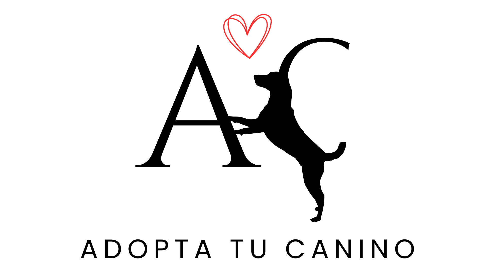

<p align="center">
  
</p>


# Adopta tu canino 🐶

## 📌 Descripción del proyecto
Aplicación web desarrollada como Trabajo Fin de Máster (TFM) cuyo objetivo es facilitar el proceso de adopción de perros por parte de protectoras y asociaciones, al igual que para los usuarios interesados en adoptar una nueva mascota.

La aplicación permite consultar la información de los perros disponibles para adopción, incluyendo datos como su edad, raza, tamaño, carácter, compatibilidad con otros animales, necesidades especiales, fotografías y vídeos.

Los usuarios pueden registrarse, iniciar sesión y enviar solicitudes de adopción para los perros disponibles. Por otra parte, los usuarios autorizados pueden gestionar la información de los animales y las solicitudes recibidas, pudiendo rechazarlas o aceptarlas.

Además, la aplicación incorpora un chatbot orientado a ayudar a los usuarios en la búsqueda de un perro compatible con su estilo de vida y preferencias. A través de una conversación en lenguaje natural, el chatbot recopila e interpreta las preferencias del usuario y proporciona recomendaciones utilizando un sistema de reglas de negocio.

## 🆗 Funcionalidades implementadas

- Visualización del listado de perros disponibles para adopción.
- Visualización de la información de cada perro.
- Filtrado de perros según sus características.
- Gestión de fotografías y vídeos asociados a los perros.
- Creación y consulta de solicitudes de adopción.
- Aceptación y rechazo de solicitudes mediante endpoints específicos.
- Actualización automática del estado de adopción de un perro cuando una solicitud es aceptada.
- Registro e inicio de sesión de usuarios.
- Autenticación mediante JSON Web Token (JWT).
- Gestión de perros y solicitudes de adopción por usuarios administradores.
- Recomendaciones de adopción mediante un chatbot.
- Gestión de las ubicaciones asociadas a los perros.
- Gestión de los temperamentos asociados a los perros.

## 👩🏼‍💻 Tecnologías utilizadas 
### Backend
- Python
- Django
- Django REST Framework
- SQLite para desarrollo local
- API de OpenAI
- JWT
- PostgreSQL para producción

### Frontend
- React
- Vite
- React Router
- React Bootstrap
- CSS
- Bootstrap Icons

### Despliegue
- Railway

## 📁 Estructura del proyecto
```text
dog_adoption/
├── backend/
├── frontend/
├── docs/
    ├── logo_adopta_tu_canino.png
├── .gitignore
├── README.md
```

### Arquitectura del proyecto
La aplicación está estructurada en dos partes principales:
- **Backend**: desarrollado con Django. Se encarga de la lógica de negocio, el acceso a la base de datos, la autenticación y la exposición de la API REST.
- **Frontend**: desarrollado con React y Vite. Se encarga de la interfaz de usuario y la comunicación con la API del backend.

Gracias a esta separación, se permite distribuir las responsabilidades de la aplicación y facilitar su mantenimiento y evolución.

##  ⚙ Ejecutar el proyecto

### 1. Clonar el repositorio

```bash
git clone https://github.com/Vero7nicaRS/adopcion-perros.git
cd dog_adoption
```

### 2. Configuración del Backend

Acceder a la carpeta "backend":
```bash
cd backend
```

Crear el entorno virtual:
```bash
python -m venv .venv
```

Activar el entorno virtual:
```bash
# Windows
.venv\Scripts\activate

# Linux/Mac
source .venv/bin/activate
```

Instalar las dependencias:
```bash
pip install -r requirements.txt
```

Migraciones y ejecución del programa:
```bash
python manage.py migrate
python manage.py runserver
```

El backend estará disponible en:
```bash
http://127.0.0.1:8000/
```

### 3. Configuración del Frontend

Desde la raíz del proyecto, acceder a la carpeta "frontend":
```bash
cd frontend
```

Instalar las dependencias:
```bash
npm install
```

Ejecutar el proyecto:
Introducir la siguiente línea de comando: 

```bash
npm run dev
```

El frontend estará disponible en:
```text
http://localhost:5173/

```

## Endpoints desarrollados
Los principales endpoints desarrollados en la aplicación son:

### Autenticación

| Método | Endpoint | Descripción |
|--------|----------|-------------|
| POST | `/api/token/` | Iniciar sesión y obtener los tokens de autenticación |
| POST | `/api/token/refresh/` | Renovar el token de acceso |
| GET | `/adopta_tu_canino/usuarios/me/` | Obtener la información del usuario autenticado |


### Perros

| Método | Endpoint | Descripción |
|--------|----------|-------------|
| GET | /adopta_tu_canino/perros/ | Obtener todos los perros |
| GET | /adopta_tu_canino/perros/:id | Obtener un perro en concreto |
| POST | /adopta_tu_canino/perros/ | Crear un perro |
| PUT | /adopta_tu_canino/perros/:id | Modificar un perro |
| PATCH | /adopta_tu_canino/perros/:id | Modificación parcial de un perro  |

Los perros no pueden eliminarse directamente de la aplicación, permitiendo conservar su información e historial.

### Solicitudes de adopción

| Método | Endpoint | Descripción |
|--------|----------|-------------|
| GET | /adopta_tu_canino/solicitud-adopcion/ | Obtener las solicitudes propias o todas las solicitudes para usuarios administradores |
| GET | /adopta_tu_canino/solicitud-adopcion/:id/ | Obtener una solicitud concreta |
| POST | /adopta_tu_canino/solicitud-adopcion/ | Crear una solicitud de adopción |
| PATCH | /adopta_tu_canino/solicitud-adopcion/:id/accept_status/ | Aceptar una solicitud pendiente |
| PATCH | /adopta_tu_canino/solicitud-adopcion/:id/reject_status/ | Rechazar una solicitud pendiente |

Las solicitudes de adopción no pueden modificarse ni eliminarse directamente una vez enviadas. Los cambios de estado se realizan mediante los endpoints específicos de aceptación y rechazo.

### Chatbot
| Método | Endpoint | Descripción |
|--------|----------|-------------|
| POST | `/adopta_tu_canino/chatbot/` | Enviar las preferencias del usuario y obtener una respuesta o recomendaciones de perros |

**NOTA**: La API dispone además de endpoints auxiliares para la gestión de usuarios, ubicaciones, temperamentos, fotografías y vídeos. Algunos de ellos se utilizan internamente por las funcionalidades de gestión de la aplicación.

## 📹 Recursos multimedia

Por motivos de tamaño, este repositorio no incluye la carpeta `backend/media/`, donde se almacenan las fotografías y los vídeos asociados a los perros.


## Estado del proyecto

✅ En producción. 

El proyecto se encuentra desplegado y dispone de las principales funcionalidades previstas. Asimismo, se podrán incorporar nuevas funcionalidades y mejoras en futuras versiones de la aplicación.

## 👩🏽‍💻 Autor

Verónica Rodríguez Sánchez

Trabajo de Fin de Máster

Máster en Desarrollo de Aplicaciones Web